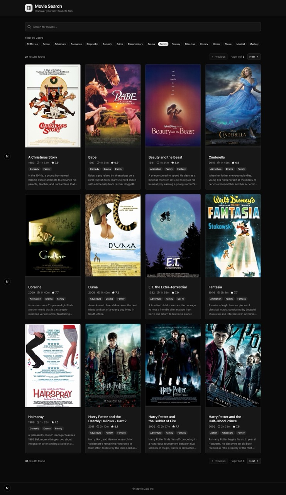
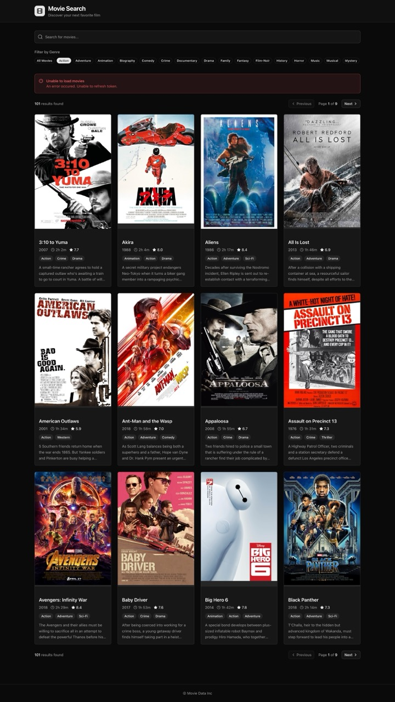

## Demo

View the deployed app at https://movies-app-puce-nu.vercel.app

## Screenshots

<table style="width:100%; table-layout:fixed; border-collapse:collapse; margin-top:0.75rem; border:none;">
  <thead>
    <tr style="background:#1f1f1f; color:#fff; border:none;">
      <th style="text-align:left; padding:0.75rem; border:none;">Default Search</th>
      <th style="text-align:left; padding:0.75rem; border:none;">Error Handling</th>
      <th style="text-align:left; padding:0.75rem; border:none;">No Results State</th>
    </tr>
  </thead>
  <tbody>
    <tr style="border:none;">
      <td valign="top" style="border:none; width:33.33%;"></td>
      <td valign="top" style="border:none; width:33.33%;"></td>
      <td valign="top" style="border:none; width:33.33%;"></td>
    </tr>
  </tbody>
</table>

## General / Overview

This project is a movie search experience backed by a GraphQL API, with secure token handling and a URL-synced search flow that keeps pagination, genres, and query text aligned. The UI leans on Tailwind’s design tokens for light/dark parity, includes resilient poster rendering with fallbacks, and ships with lightweight unit tests around the API helpers so the core data mapping logic stays reliable.

I considered submitting the project from a fresh repository, but opted to keep the full commit history intact. The transparency felt more valuable so you can see how the implementation evolved.

## API Feedback

- The REST surface lacks a lightweight `/genres` endpoint, so pulling the list of genre filters via `/genres/movies` without hundreds of embedded movies wasn’t feasible. I leaned on GraphQL to fetch only the needed fields.
- The REST `/movies/{id}` endpoint exposes summary/runtime/cast etc., but the search endpoint `/movies?` does not. Fetching a page of results and then issuing a detail call per movie would be unacceptably chatty, so GraphQL was the only practical way to retreive all of the metadata at once.
- Neither REST nor GraphQL pagination responses include a `totalRecords` field. To show total counts I fetch the final page and calculate the total. With API support I’d eliminate that extra request.

## Highlights

The most noteworthy design and implementation decisions I made:

- **Dark mode & theming**: Tailwind tokens keep the UI consistent across light/dark, including cards, filters, and pagination.
- **Poster fallback with loader**: `ImageWithFallback` shows a spinner while images stream in and swaps to a readable text message if the poster fails.
- **Secure data fetching**: The auth helper acquires tokens, retries once on 401, and surfaces actionable errors to the UI.
- **URL-synced search**: Search text, genre, and page stay mirrored in the URL, with debounced updates, abortable fetches, and both “Esc” and “X” clear actions.
- **Card polish**: Movie plots show tooltips on hover so truncation doesn’t hide the full summary.
- **API tests**: Node’s built-in test runner covers the parsing helpers. (I’d typically opt for Jest or Vitest once the suite grows.)

## What I'm Proud Of

I’m most proud of how I handled the search-total requirement despite the API not providing a total record count. I treated this as an intentional real-world constraint and implemented a clean double-fetch strategy with secure token handling and unified error management, without requiring any backend changes. In a production setting, I would normally advocate for addressing this at the API level.

Other noteworthy items:

- Delivering secure, resilient data fetching (token refresh, unified error handling).
- Keeping the search experience fast and intuitive by syncing URL state, debouncing updates, and seeding SSR data to avoid layout shift.
- Adding polish touches (poster fallback with spinner, tooltipped plots, clear search controls) that make the UI feel thoughtful.
- Writing lightweight API unit tests that prove the parsing/mapping logic works and will stay stable.
- Maintaining a transparent commit history so reviewers can follow the full implementation journey.
## If I Had More Time

Given more time, I would consider the following improvements:

- Expand test coverage (token-refresh paths, GraphQL error cases) and move shared constants into a dedicated module.
  - Add a light E2E test suite to exercise critical flows (search, pagination, error handling) under real browser conditions.
- Build accessibility upgrades: tighter keyboard support for pagination/filters, ARIA-live announcements for loading/error states, and high-contrast theme adjustments.

As the project grows, I would consider the following additions:
- Add GraphQL codegen and tighter typing once the schema stabilizes, plus richer browse features (watchlists, trailers) when the API supports them.
- Extract repeat Tailwind patterns into `@layer components` utilities via `@apply`. For now the styles are varied enough that centralizing them would be overkill, but I’d adopt that approach once the reuse surface is clearer.
- Introduce React Query once data needs to be shared across components or mutated more frequently, providing a centralized caching and invalidation. The current single-consumer flow didn’t justify the added dependency.
- Implement localized formatting and i18n scaffolding so runtime strings, dates, and numbers adapt cleanly for other locales.
- Add performance monitoring (Lighthouse CI, Web Vitals) to catch bundle and interaction regressions early.
- Explore offline-friendly caching of the last successful search/genre list so users see useful data even with spotty connectivity.
- Layer in observability (Sentry, OpenTelemetry) around GraphQL fetches/token refreshes to spot production issues quickly.
- When global concerns emerge (favorites, watchlists, shared filters), introduce a predictable state layer (Redux Toolkit/Zustand) to avoid prop drilling and simplify debugging.
- Implement analytics for key flows (search/query submissions, genre selections, error states) so both marketing and engineering can spot usage trends, quantify regressions, and justify future investments.

## AI Usage

I implemented the feature work manually - including the GraphQL implementation, search UX, and UI polish. I used OpenAI’s Codex only for small assists, primarily to accelerate unit-test scaffolding. All architectural decisions, implementation details, and final code are my own, and I can discuss any part of the solution in depth.
