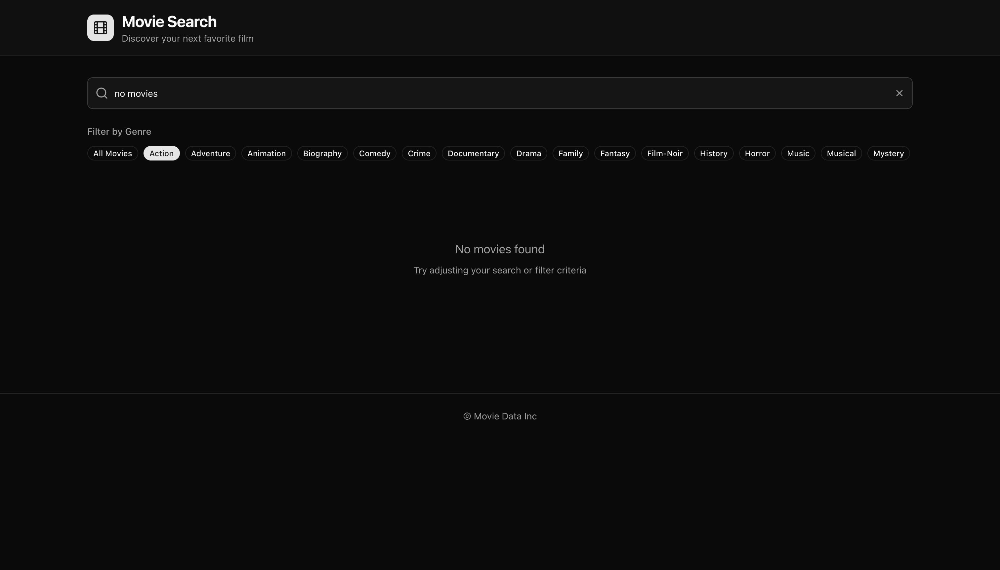

## Demo

View the deployed app at https://movies-app-puce-nu.vercel.app

## Screenshots

<table style="width:100%; border-collapse:collapse; margin-top:0.75rem; border:none;">
  <thead>
    <tr style="background:#1f1f1f; color:#fff; border:none;">
      <th style="text-align:left; padding:0.75rem; border:none;">Default Search</th>
      <th style="text-align:left; padding:0.75rem; border:none;">Error Handling</th>
      <th style="text-align:left; padding:0.75rem; border:none;">No Results State</th>
    </tr>
  </thead>
  <tbody>
    <tr style="border:none;">
      <td valign="top" style="border:none;"></td>
      <td valign="top" style="border:none;"></td>
      <td valign="top" style="border:none;"></td>
    </tr>
  </tbody>
</table>

## API Feedback

- The REST surface lacks a lightweight `/genres` endpoint, so pulling the list of genre filters via `/genres/movies` without hundreds of embedded movies wasn’t feasible. I leaned on GraphQL to fetch only the needed fields.
- The REST `/movies/{id}` endpoint exposes summary/runtime/cast etc., but the search endpoint `/movies?` does not. Fetching a page of results and then issuing a detail call per movie would be unacceptably chatty, so GraphQL was the only practical way to retreive all of the metadata at once.
- Neither REST nor GraphQL pagination responses include a `totalRecords` field. To show total counts I fetch the final page and calculate the total. With API support I’d eliminate that extra request.

## Highlights

- **Dark mode & theming**: Tailwind tokens keep the UI consistent across light/dark, including cards, filters, and pagination.
- **Poster fallback with loader**: `ImageWithFallback` shows a spinner while images stream in and swaps to a readable text message if the poster fails.
- **Secure data fetching**: The auth helper acquires tokens, retries once on 401, and surfaces actionable errors to the UI.
- **URL-synced search**: Search text, genre, and page stay mirrored in the URL, with debounced updates, abortable fetches, and both “Esc” and “X” clear actions.
- **Card polish**: Movie plots show tooltips on hover so truncation doesn’t hide the full summary.
- **API tests**: Node’s built-in test runner covers the parsing helpers. (I’d typically reach for Vitest once the suite grows.)

## If I Had More Time

- Reintroduce React Query once data needs to be shared across components or mutated frequently; the current single-consumer flow didn’t justify the dependency.
- Expand test coverage (token-refresh paths, GraphQL error cases) and move shared constants into a dedicated module.
- Add GraphQL codegen and tighter typing once the schema stabilizes, plus richer browse features (watchlists, trailers) when the API supports them.

## AI Usage

I implemented the feature work manually—including the GraphQL implementation, search UX, and UI polish. I used OpenAI’s Codex only for small assists, primarily to accelerate unit-test scaffolding. All architectural decisions, implementation details, and final code are my own, and I can discuss any part of the solution in depth.